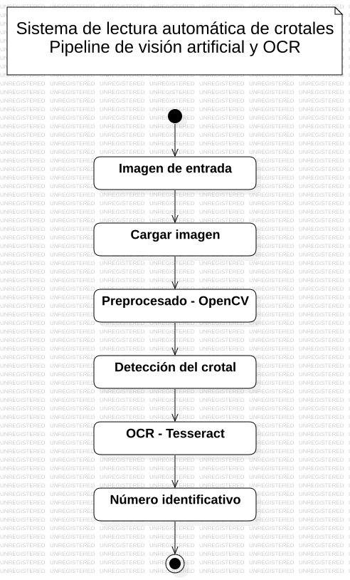

# Sistema de Lectura Automática de Crotales de Animales (OCR)

[]()
[]()
[]()

## Introducción

Este proyecto consiste en el desarrollo de un sistema avanzado de **Visión Artificial** diseñado para automatizar la identificación de ganado en entornos industriales. La solución permite la lectura y validación de códigos numéricos en crotales bovinos mediante técnicas de **Reconocimiento Óptico de Caracteres (OCR)**.

Desarrollado por **Jaudre Computer Vision Services** para la empresa cárnica **Fribin**, el sistema busca optimizar la trazabilidad en planta, reduciendo el error humano y acelerando el procesamiento de datos en la línea de producción.

## Objetivo del Proyecto

El núcleo del sistema es una aplicación de procesamiento de imágenes que:
1.  **Captura:** Recibe imágenes individuales de crotales desde una cámara fija en cinta transportadora.
2.  **Procesa:** Localiza la región de interés, mejora el contraste y corrige la alineación del texto.
3.  **Identifica:** Extrae la secuencia numérica inferior del crotal (habitualmente de 4 o 5 dígitos)
4.  **Valida:** Contrasta el resultado con un *Ground Truth* (fichero Excel del lote) para detectar duplicados o registros inexistentes.

## Arquitectura del Sistema

El sistema sigue un pipeline secuencial de visión artificial para la lectura de crotales.



El flujo de procesamiento es:

Dataset → Carga de imagen → Preprocesado → OCR → Resultado

## Tecnologías Principales

* **Lenguaje:** Python
* **Visión Artificial:** OpenCV
* **Motor OCR:** EasyOCR
* **Hardware:** Raspberry Pi 5
* **Estándar de Documentación:** IEEE Std 29148-2018

---

## Estructura del Proyecto
```
.
├── data/        # Imágenes de prueba de crotales
├── demo/        # Demostración
├── docs/        # Documentación relacionada al proyecto
├── src/         # Código fuente del sistema
├── tests/       # Tests unitarios
├── utils/       # Funciones auxiliares
├── README.md
└── requirements.txt
```

## Instalación

Este proyecto ha sido desarrollado y testado con **Python 3.12.12.**

1. Clonar el repositorio:

```bash
git clone https://github.com/jaaumeadrover/AIVA_2026-BovineVision.git
cd AIVA_2026-BovineVision
```
2. Instalar dependencias:

`pip install -r requirements.txt`

## Ejecución

El script principal `predict.py` actúa como el punto de entrada para el sistema. Permite alternar entre el procesamiento de una imagen individual o el análisis por lotes de un directorio completo.


**IMPORTANTE:** Para asegurar la correcta resolución de módulos internos, los comandos deben ejecutarse siempre desde la raíz del proyecto utilizando el flag -m.


### 1. Procesamiento de Imagen Individual
Ideal para pruebas rápidas o integración con disparadores de cámara en tiempo real. Utiliza el argumento `--img` seguido de la ruta del archivo.

```bash
python -m src.predict --img <your_img.TIF> --out <your_file.txt>
```
Donde:

* ``img``: corresponde a la imagen de entrada
* ``out``: corresponde al fichero de salida con el texto.
### 2. Procesamiento por lotes (Batch Mode)

Diseñado para evaluar datasets completos y generar métricas de rendimiento. Se activa mediante el argumento ``--dir``.

```bash
python -m src.predict --dir <path/to/data/folder> --eval <your_file.csv>
```

Donde:

* ``dir``: corresponde a la carpeta donde se almacena el dataset.
* ``eval``: corresponde al fichero de salida en formato csv para almacenar todos los resultados.


### 3. Ayuda y parámetros
Para cualquier duda de uso, véase la guía:

```bash
python -m src.predict --help
```

### 4. Ejemplos ejecución

Véase algunos ejemplos:

**Procesar una sola imagen:**
```bash
python -m src.predict --img data/TestSamples/0001.TIF --out result.txt
```

**Procesar un dataset completo:**
```bash
python -m src.predict --dir data/TestSamples/ --eval output.csv
```

### 5. Validación y tests

Para asegurar que los módulos de preprocesamiento e inferencia funcionan correctamente tras la instalación, se puede ejecutar la batería de tests unitarios:
```bash
python -m pytest tests/
```

---

## Metodología de Desarrollo (GitFlow)

Para garantizar la estabilidad del sistema en producción (Raspberry Pi 5) y mantener un historial de cambios limpio, seguimos un flujo de trabajo basado en **Feature Branches**:

1.  **Creación de Tarea:** Cada nueva funcionalidad o corrección debe tener una *Issue* asignada con el prefijo `ETR-X`.
2.  **Ramificación:** No se trabaja directamente sobre `main` ni `dev`. Se crea una rama específica:
    * `git checkout -b feature/ETR-X-descripcion-corta`
3.  **Desarrollo e Integración:**
    * Se realizan los commits en la rama local.
    * Una vez finalizado, se sube la rama al repositorio: `git push origin feature/ETR-X-descripcion-corta`.
4.  **Pull Request (PR):**
    * Se abre un PR hacia la rama **`dev`** para integración y pruebas.
    * Tras validar el funcionamiento en el entorno de desarrollo, se realiza el merge.
5.  **Despliegue a Producción:** Solo el código verificado en `dev` se mergeará mediante PR a la rama **`main`** para su despliegue final en planta.

> ### Regla de Oro
> **Todo Pull Request debe referenciar la Issue correspondiente** (ej. `Closes #12`) para mantener la trazabilidad de los requisitos, tareas de desarrollo y cambios en el código.


## Contexto Operativo

El sistema está diseñado para operar en condiciones de iluminación controlada, procesando imágenes de forma secuencial con un tiempo de respuesta inferior a **2 segundos**, garantizando una integración fluida en el flujo de trabajo continuo de la planta de procesado.

---
© 2026 Jaudre Computer Vision Services. Todos los derechos reservados.
